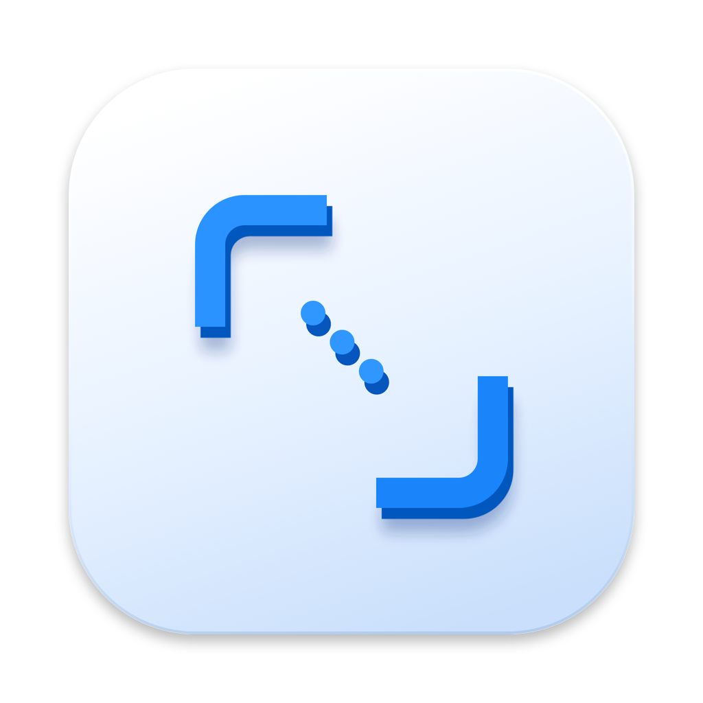
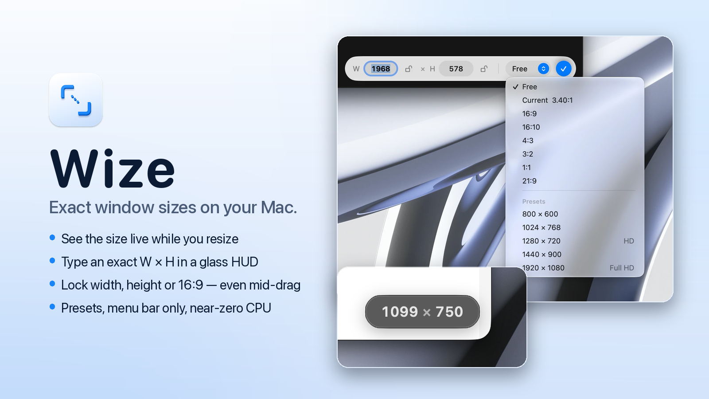
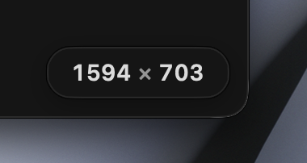
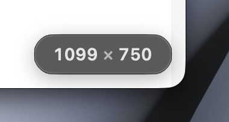
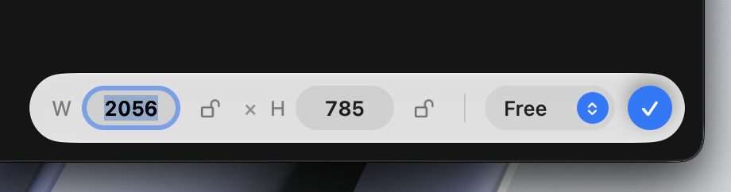
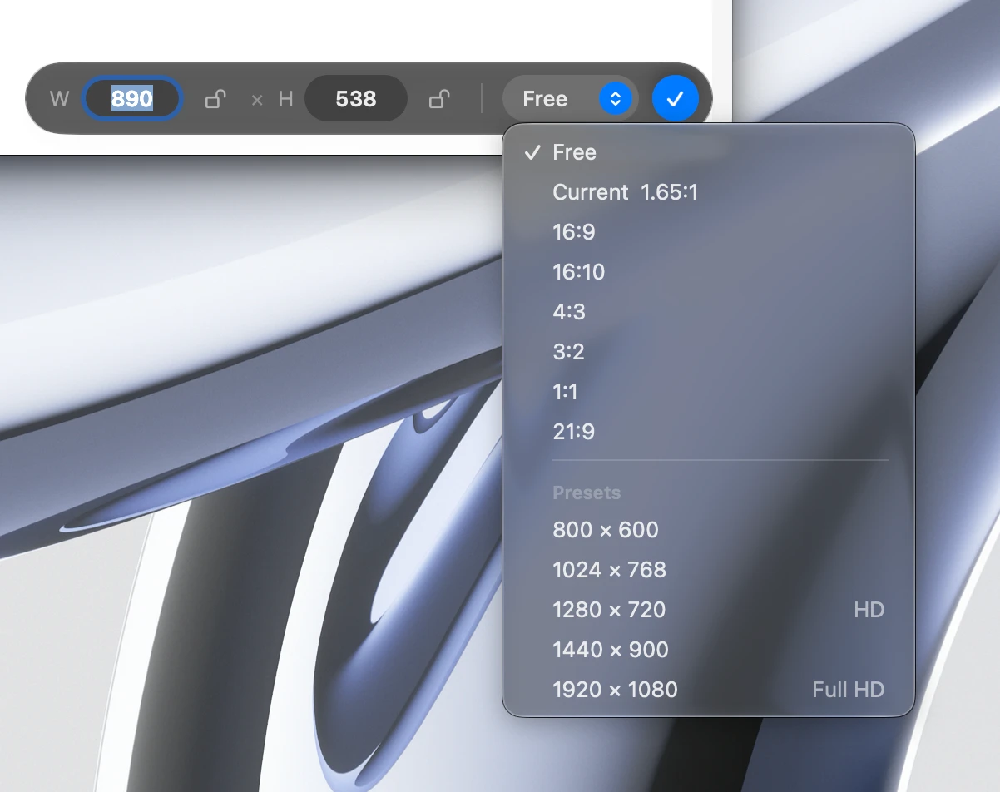
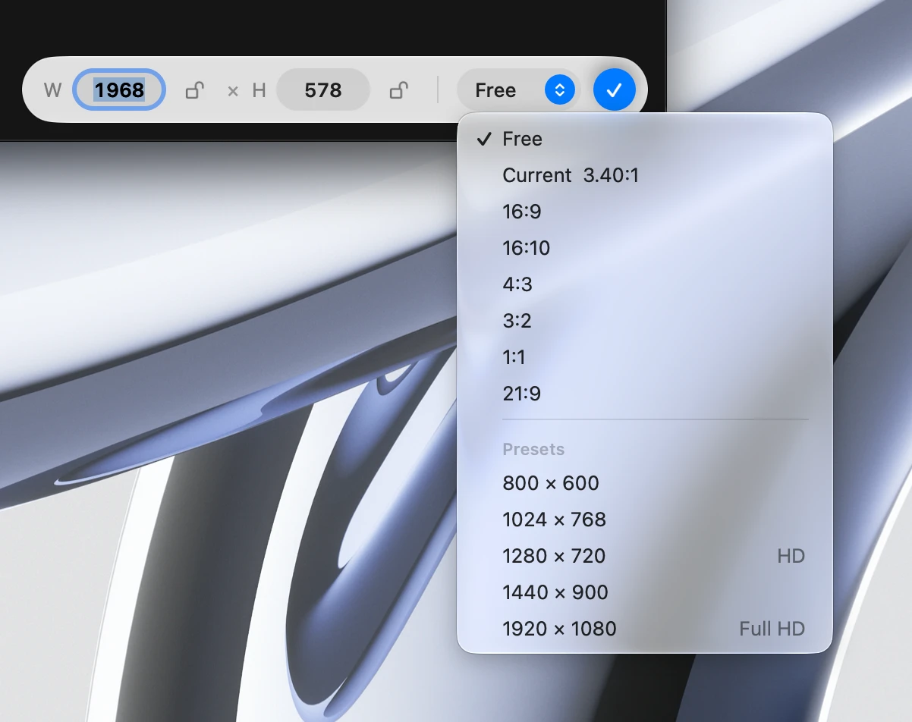

<p align="center">
  
</p>

<h1 align="center">Wize</h1>

<p align="center">
  Exact window sizes on your Mac.<br>
  A small menu bar app that shows the size of a window while you resize it,<br>
  and lets you type an exact size or lock an aspect ratio.
</p>

<p align="center">
  <a href="https://github.com/troshkinpavel/wize/releases/latest"><b>Download for macOS</b></a>
  &nbsp;·&nbsp; macOS 14+ &nbsp;·&nbsp; Apple silicon and Intel &nbsp;·&nbsp; free
</p>

<p align="center">
  <picture>
    <source media="(prefers-color-scheme: dark)" srcset="docs/images/wize-hero-1600x900-dark.png">
    
  </picture>
</p>

## What it does

**See the size while you resize.** Drag a window edge or corner and a glass badge sticks to the corner with the live size, like `1280 × 720`. It fades away a moment after you stop. Hold ⌥ to also see the position.

| Dark window | Light window |
|---|---|
|  |  |

**Type an exact size.** Click the badge (or use the menu, or press ⌃⌥E anywhere) and it opens into a small bar. Type W and H, press Return, done. ↑/↓ nudge by 1, ⇧↑/⇧↓ by 10, Esc cancels.



**Lock width, height or aspect ratio.** Lock W, H, or a ratio like 16:9. The window keeps it while you drag, not just after you let go. Handy for screen recordings, screenshots and testing layouts.

**Ratios and presets.** 16:9, 16:10, 4:3, 3:2, 1:1, 21:9, plus size presets (HD, Full HD and your own).

| Dark | Light |
|---|---|
|  |  |

### Also

- Lives in the menu bar, no Dock icon.
- Badge can sit inside or outside the window, in any corner.
- Works across monitors and Spaces, and stays out of the way for maximized and full-screen windows.
- Uses no CPU when you're not resizing. Native Swift, no dependencies.
- Liquid Glass look on macOS 26 and later, frosted blur on macOS 14 and 15.

## Install

1. Download `Wize-1.0.0.zip` from [Releases](https://github.com/troshkinpavel/wize/releases/latest) and unzip it.
2. Move **Wize.app** to Applications and open it. The app is signed and notarized by Apple.
3. Give Wize **Accessibility** access when it asks (System Settings → Privacy & Security → Accessibility). Wize needs it to read and set window sizes. It never reads what's inside windows, and it doesn't connect to the internet.

Optional: turn on **Launch at login** in Wize → Settings.

## Build from source

Requires Xcode 16 or later.

```sh
git clone https://github.com/troshkinpavel/wize.git
cd wize
./build.sh            # builds build/Wize.app
open build/Wize.app
```

## Known limits

- Only windows of the app in front are tracked. You usually click a window before resizing it anyway.
- Some apps don't let other apps resize their windows. Wize greys out the controls for those.
- If you change Wize's code and rebuild it with ad-hoc signing, macOS forgets the Accessibility permission and you have to grant it again.

## License

[MIT](LICENSE)
